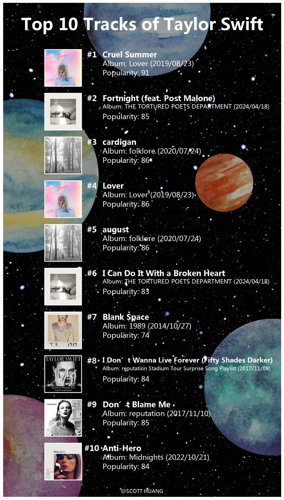
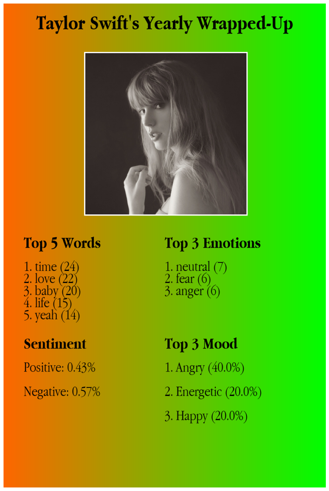

# 🎵 ArtistViz: Interactive Artist Data Visualization & Analysis

**ArtistViz** is a data visualization project that transforms lyrical and streaming metadata into emotional and thematic portraits of an artist’s musical journey. This tool allows users to analyze emotion trends, lyrical themes, and mood distributions across songs using data retrieved from the **Spotify** and **Genius** APIs.

---

## 🧠 Project Motivation

Music streaming platforms offer great accessibility, but limited insight into the **emotional content** of songs or the **evolution of an artist's themes** over time. This project fills that gap by visualizing:
- Emotion frequency and mood evolution in lyrics
- Sentiment progression over time
- Summarized visual posters tailored for **artists** instead of listeners

---

## 🛠️ Tools & Technologies

- **APIs:** Spotify Web API, LyricsGenius API
- **Languages & Libraries:** Python, Jupyter, Pandas, NumPy, Requests, NLTK, Scikit-learn, PIL, Matplotlib
- **Models Used:** DistilBERT (emotion detection), LDA (topic modeling), VADER (sentiment analysis)

---

## 📊 Visualizations

### 1. 🎼 Lyric Frequency by Song
A **heatmap** of 7 detected emotions across songs using DistilBERT.

### 2. 🎭 Mood Distribution by Track
A **bar chart** showing mood classification (Romantic, Happy, Sad, Angry, Energetic) based on LDA.

### 3. 📈 Emotion Trend Over Time
A **line chart** visualizing sentiment trajectory using VADER, showing emotion shifts through discography.

---

## 🖼️ Poster Highlights

### 🏆 Top 10 Songs Poster

### 📆 Yearly Wrap-Up Poster

